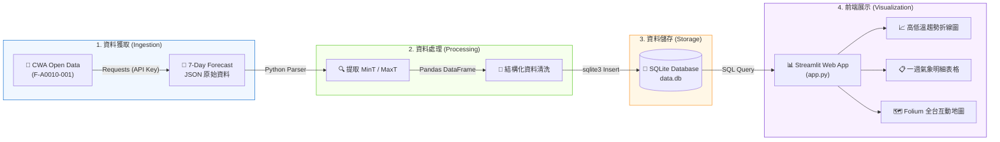

<div align="center">

# 🌤️ Taiwan Weather Forecast Dashboard
### 氣象資料到互動式天氣預報 Web 應用程式
**CWA API × JSON × Python × SQLite × Streamlit**

[](https://www.python.org/)
[](https://www.sqlite.org/)
[](https://streamlit.io/)
[](https://python-visualization.github.io/folium/)
[](https://opendata.cwa.gov.tw/)

<br/>

> 💡 *「技術可以解決問題，但更重要的是用技術創造更好的未來！」* —— **煥哥**  
> 🚀 *用程式探索天氣・用資料看見台灣・用 AI 實現更多可能*  
> 🌟 **Learn Today, Build Tomorrow. Code Smarter, Build a Better Tomorrow!**

---

</div>

## 📌 專案總覽 (Overview)

本專案為 **「AI 創新微課程」** 核心實作專案，整合 **AI × 資料科學 × 氣象資料 × 現代 Web 應用**。  
整體架構採用端到端（End-to-End）管線：
1. **資料介接**：向中央氣象署（CWA）開放資料平臺請求 7 天預報原始資料（`F-A0010-001`）。
2. **資料處理**：以 Python 剖析多層巢狀 JSON 結構，提取六大區域（北部、中部、南部、東北部、東部、東南部）之每日最高與最低氣溫。
3. **資料庫管理**：存入標準 SQLite 資料庫（`data.db`），建立正規化結構並執行 SQL 查詢驗證。
4. **前端視覺化**：透過 Streamlit 與 Folium 構建互動儀表板，支援區域篩選、一週氣溫趨勢折線圖、資料表以及全台溫標地圖。

---

## 🔄 數據管線與系統架構 (Data Pipeline Architecture)



---

## 🗺️ 24 單元完整學習地圖 (Curriculum Roadmap)

整體微課程分為六大階段、共 24 單元，按循序漸進原則實作：

| 階段 | 單元範圍 | 核心主題 | 關鍵技術與產出 |
| :---: | :---: | :--- | :--- |
| **Phase 1** | 單元 01 ~ 04 | **氣象資料獲取** | CWA 帳號註冊、API Key 申請、Requests 請求 JSON |
| **Phase 2** | 單元 05 ~ 07 | **JSON 解析與整理** | 巢狀 JSON 剖析、MinT/MaxT 提取、Pandas 結構化處理 |
| **Phase 3** | 單元 08 ~ 10 | **SQLite 資料庫** | `data.db` 建立、`TemperatureForecasts` 表設計、SQL 驗證 |
| **Phase 4** | 單元 11 ~ 16 | **Streamlit 預報儀表板** | 下拉選單切換、SQL 動態查詢、高低溫折線圖、一週數據表 |
| **Phase 5** | 單元 17 ~ 19 | **進階地圖視覺化** | Folium 地圖整合、四色溫標區間、日期切換、地區氣溫 Popup |
| **Phase 6** | 單元 20 ~ 24 | **工程品質與延伸應用** | 程式模組化、錯誤處理、GitHub 版本控管、LINE Bot/AI 延伸 |

<details>
<summary><b>🔍 點擊展開：24 個單元詳細教學與實作規範</b></summary>

<br/>

### 🔹 階段一：氣象資料獲取 (Modules 01–04)
* **01. 課程介紹**：學習目標、整體學習地圖、專案成果演示。
* **02. 台灣的天氣與生活**：氣候特徵分析、數據驅動決策與智慧生活情境。
* **03. 中央氣象署 CWA 平台**：平臺註冊、取得個人 API 授權碼、選取資料集（`F-A0010-001`）。
* **04. API 資料取得**：使用 `requests` 發起 GET 請求並驗證狀態碼：
  ```python
  import requests

  url = "https://opendata.cwa.gov.tw/api/v1/rest/datastore/F-A0010-001"
  headers = {"Authorization": "YOUR_API_KEY"}
  resp = requests.get(url, headers=headers, timeout=30)
  data = resp.json()
  ```

### 🔹 階段二：JSON 解析與資料整理 (Modules 05–07)
* **05. JSON 資料結構解析**：拆解深層路徑：
  ```text
  records ➔ locations ➔ location[] ➔ weatherElement[] ➔ time[]
  ```
* **06. 提取最高與最低氣溫**：精準抽取 `MinT`（最低氣溫）與 `MaxT`（最高氣溫）。
* **07. 資料整理與預覽**：透過 Pandas 建立清洗後的 Dataframe：
  | regionName | dataDate | minT | maxT |
  | :--- | :---: | :---: | :---: |
  | 北部地區 | 2026-04-14 | 18 | 26 |
  | 中部地區 | 2026-04-14 | 20 | 30 |
  | 南部地區 | 2026-04-14 | 22 | 31 |

### 🔹 階段三：SQLite 資料庫設計與驗證 (Modules 08–10)
* **08. 建立 SQLite 資料庫**：自動建立本機 `data.db` 儲存預報資料。
* **09. 資料庫設計**：建立結構嚴謹的關聯式資料表：
  ```sql
  CREATE TABLE IF NOT EXISTS TemperatureForecasts (
      id INTEGER PRIMARY KEY AUTOINCREMENT,
      regionName TEXT NOT NULL,
      dataDate TEXT NOT NULL,
      minT REAL NOT NULL,
      maxT REAL NOT NULL
  );
  ```
* **10. 查詢資料驗證**：利用 SQL 確保全台六大區域資料寫入無誤：
  ```sql
  SELECT DISTINCT regionName FROM TemperatureForecasts;
  SELECT * FROM TemperatureForecasts WHERE regionName = '中部地區';
  ```

### 🔹 階段四：Streamlit 互動預報儀表板 (Modules 11–16)
* **11. Streamlit 入門**：快速構建 Web UI，認識元件與 Layout 配置。
* **12. 從資料庫讀取資料**：透過 `sqlite3` + `pd.read_sql_query` 即時查詢。
* **13. 下拉選單選擇地區**：提供六大區域選取切換（北部、中部、南部、東北部、東部、東南部）。
* **14. 繪製折線圖**：動態繪製一週最高溫（紅色趨勢線）與最低溫（藍色趨勢線）。
* **15. 顯示資料表格**：結構化展示 7 天完整的日期與溫度數值。
* **16. 整合 Web App 介面**：完成具備一致性與現代質感的氣象資訊頁面。

### 🔹 階段五：進階台灣地圖視覺化 (Modules 17–19)
* **17. 台灣地圖視覺化**：整合 `folium` 與 `streamlit-folium` 渲染互動圖層。
* **18. 選擇日期顯示地圖**：提供日期篩選下拉選單，地圖標記顯示該日各區氣溫 Popup。
  * 🔵 `< 20°C`：藍色（涼爽 / 寒冷）
  * 🟢 `20 - 25°C`：綠色（舒適）
  * 🟡 `25 - 30°C`：黃色（溫暖）
  * 🔴 `> 30°C`：紅色（炎熱）
* **19. 完整成果展示**：儀表板與全台氣溫地圖聯動展示。

### 🔹 階段六：工程品質、GitHub 與未來延伸 (Modules 20–24)
* **20. 程式碼品質與優化**：
  * 模組化職責分離（爬蟲、解析、DB、UI）。
  * 加入健全的 `try-except` 錯誤處理機制。
  * 冪等性設計：更新資料時防止重複累積膨脹。
* **21. 專案上傳至 GitHub**：Git 版控、設定 `.gitignore` 防止敏感 API 金鑰洩漏。
* **22. 延伸應用與想法**：天氣提醒 LINE Bot、旅遊推薦、農業防災智慧預警。
* **23. 回顧與重點整理**：回顧端到端開發技能與 AI 協同開發實務。
* **24. 下一步：繼續探索**：串接更多政府開放資料，開發個人代表作品集。

</details>

---

## 📂 專案目錄結構 (Project Structure)

```text
d:/File/
├── fetch_weather.py     # [Phase 1] 串接 CWA API 下載原始預報 JSON
├── parse_weather.py     # [Phase 2] 解析 JSON 並利用 Pandas 結構化資料
├── database.py          # [Phase 3] 初始化 SQLite 資料庫並匯入資料
├── app.py               # [Phase 4 & 5] Streamlit Web 應用主程式
├── data.db              # [Phase 3] SQLite 資料庫檔案
├── requirements.txt     # Python 依賴套件清單
├── workflow.md          # 英文版開發作業流程與評分量表 (Rubric)
└── README.md            # 專案首頁說明文件
```

---

## ⚡ 快速開始指南 (Quick Start Guide)

### 1️⃣ 建立虛擬環境 (建議)
```bash
# 建立虛擬環境
python -m venv venv

# Windows (PowerShell)
venv\Scripts\activate

# macOS / Linux
source venv/bin/activate
```

### 2️⃣ 安裝依賴套件
```bash
pip install -r requirements.txt
```

> [!NOTE]
> **推薦套件清單 (`requirements.txt`)**：
> ```text
> requests>=2.31.0
> pandas>=2.0.0
> streamlit>=1.30.0
> folium>=0.15.0
> streamlit-folium>=0.17.0
> ```

### 3️⃣ 設定 CWA API Key
前往 [中央氣象署開放資料平臺](https://opendata.cwa.gov.tw/) 註冊取得個人授權碼：
```bash
# Windows PowerShell
$env:CWA_API_KEY="YOUR_API_KEY_HERE"

# Linux / macOS
export CWA_API_KEY="YOUR_API_KEY_HERE"
```

### 4️⃣ 執行資料處理流程 (一次性產出資料庫)
```bash
python fetch_weather.py
python parse_weather.py
python database.py
```

### 5️⃣ 啟動 Streamlit 儀表板
```bash
streamlit run app.py
```
> 系統將自動於瀏覽器開啟 `http://localhost:8501`。

---

## 💾 資料庫設計 (Database Schema)

資料庫檔案：`data.db` ｜ 資料表名稱：`TemperatureForecasts`

```sql
CREATE TABLE IF NOT EXISTS TemperatureForecasts (
    id         INTEGER PRIMARY KEY AUTOINCREMENT,  -- 唯一識別碼
    regionName TEXT    NOT NULL,                  -- 地區名稱 (北部、中部、南部等)
    dataDate   TEXT    NOT NULL,                  -- 預報日期 (YYYY-MM-DD)
    minT       REAL    NOT NULL,                  -- 最低氣溫 (°C)
    maxT       REAL    NOT NULL                   -- 最高氣溫 (°C)
);
```

---

## 🛡️ 工程規範與最佳實踐 (Best Practices)

> [!IMPORTANT]
> 1. **金鑰安全保護**：嚴禁將個人 CWA API Key 明文寫入程式碼或提交（Commit）至 GitHub，應使用環境變數管理。
> 2. **架構解耦**：Streamlit 前端頁面**嚴格要求自本機 SQLite (`data.db`) 讀取資料**，不可在頁面渲染時直接連線外部 API，以確保連線速度與離線可用性。
> 3. **資料冪等性 (Idempotence)**：重新抓取資料時，應以日期與區域更新舊資料，避免重複插入造成資料筆數膨脹。
> 4. **完整性覆蓋**：資料需完整涵蓋台灣六大分區，且每個區域必須有完整的 7 天高低溫數據。

---

## 👨‍🏫 課程導師與版權資訊

* **指導講師**：煥哥（帶領大家用 AI 寫程式，探索更寬廣的世界！）
* **核心理念**：*AI for Learning, AI for a Better Taiwan.*