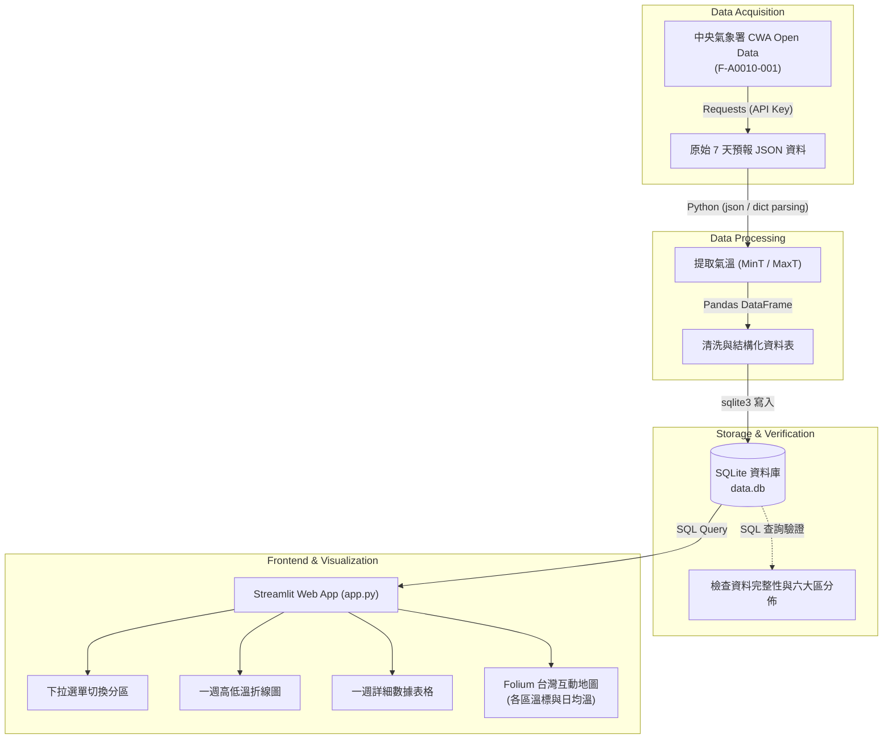

# 🌤️ Taiwan Weather Forecast: From Meteorological Data to Interactive Web App
### AI 創新微課程 | CWA API × JSON × Python × SQLite × Streamlit

[](https://www.python.org/)
[](https://www.sqlite.org/)
[](https://streamlit.io/)
[](https://python-visualization.github.io/folium/)
[](https://opendata.cwa.gov.tw/)

> *“技術可以解決問題，但更重要的是用技術創造更好的未來！” — 煥哥*  
> *“Learn Today, Build Tomorrow. Code Smarter, Build a Better Tomorrow!”*  
> *“用程式探索天氣・用資料看見台灣・用 AI 實現更多可能”*

---

## 📖 目錄 (Table of Contents)

- [專案簡介 (Overview)](#-專案簡介-overview)
- [核心架構與數據流程 (Architecture & Data Flow)](#-核心架構與數據流程-architecture--data-flow)
- [24 單元完整學習地圖 (24-Step Learning Roadmap)](#-24-單元完整學習地圖-24-step-learning-roadmap)
  - [階段一：氣象資料獲取 (Modules 1–4)](#階段一氣象資料獲取-modules-14)
  - [階段二：JSON 解析與資料整理 (Modules 5–7)](#階段二json-解析與資料整理-modules-57)
  - [階段三：SQLite 資料庫設計與驗證 (Modules 8–10)](#階段三sqlite-資料庫設計與驗證-modules-810)
  - [階段四：Streamlit 互動預報儀表板 (Modules 11–16)](#階段四streamlit-互動預報儀表板-modules-1116)
  - [階段五：進階台灣地圖視覺化 (Modules 17–19)](#階段五進階台灣地圖視覺化-modules-1719)
  - [階段六：工程品質、GitHub 與未來延伸 (Modules 20–24)](#階段六工程品質github-與未來延伸-modules-2024)
- [專案目錄結構 (Project Structure)](#-專案目錄結構-project-structure)
- [快速開始指南 (Quick Start Guide)](#-快速開始指南-quick-start-guide)
- [資料庫綱要設計 (Database Schema)](#-資料庫綱要設計-database-schema)
- [程式碼品質規範 (Code Quality & Best Practices)](#-程式碼品質規範-code-quality--best-practices)
- [未來延伸應用 (Future Possibilities)](#-未來延伸應用-future-possibilities)

---

## 🌟 專案簡介 (Overview)

本專案源自**「AI 創新微課程：從氣象資料到互動式天氣預報應用」**，由**煥哥**帶領，以 **AI × 資料 × 天氣 × 實作** 為核心主軸。

從中央氣象署（CWA）獲取即時與一週預報開放資料，透過 Python 深度解析深層巢狀 JSON 結構，以標準關聯式資料庫 SQLite 完成資料儲存與結構化管理，並利用 Streamlit 構建包含**六大分區氣溫趨勢圖**、**數據清單**以及**全台互動式氣溫分布地圖**的現代化 Web 應用程式。

---

## 🔄 核心架構與數據流程 (Architecture & Data Flow)



---

## 🗺️ 24 單元完整學習地圖 (24-Step Learning Roadmap)

```text
┌────────────────────────────────────────────────────────────────────────────────────────┐
│                              AI 創新微課程：24 單元學習脈絡                                │
├────────────────────────┬────────────────────────┬──────────────────────────────────────┤
│ 1. 課程介紹            │ 2. 台灣的天氣與生活    │ 3. 中央氣象署 CWA 平台               │
│ 4. API 資料取得        │ 5. JSON 資料結構解析   │ 6. 提取最高與最低氣溫                │
│ 7. 資料整理與預覽      │ 8. 建立 SQLite 資料庫  │ 9. 資料庫設計 (Schema)               │
│ 10. 查詢資料驗證       │ 11. Streamlit 入門     │ 12. 從資料庫讀取資料 (SQL)           │
│ 13. 下拉選單選擇地區   │ 14. 繪製氣溫折線圖     │ 15. 顯示一週資料表格                 │
│ 16. 整合 Web App 介面  │ 17. 進階：台灣地圖視覺化│ 18. 選擇日期顯示地圖                 │
│ 19. 完整成果展示       │ 20. 程式碼品質與優化   │ 21. 專案上傳至 GitHub                │
│ 22. 延伸應用與想法     │ 23. 回顧與重點整理     │ 24. 下一步：繼續探索 (AI × Data)     │
└────────────────────────┴────────────────────────┴──────────────────────────────────────┘
```

### 階段一：氣象資料獲取 (Modules 1–4)
- **單元 1：課程介紹**  
  - 了解 AI × 資料 × 天氣 × 實作的核心目標與學習地圖。
- **單元 2：台灣的天氣與生活**  
  - 理解氣象對生活、商業與防災的重要影響，體驗資料驅動決策（Data-Driven Decision Making）。
- **單元 3：中央氣象署 CWA Open Data 平台**  
  - 註冊開放資料平台帳號，申辦個人授權碼（API Key），選定目標資料集：**臺灣各縣市一週天氣預報（六大分區）**（代碼：`F-A0010-001`）。
- **單元 4：API 資料取得 (Requests)**  
  - 使用 Python `requests` 模組發送 HTTP GET 請求，以 JSON 格式獲取氣象原始數據。
  ```python
  import requests

  url = "https://opendata.cwa.gov.tw/api/v1/rest/datastore/F-A0010-001"
  headers = {"Authorization": "YOUR_API_KEY"}
  resp = requests.get(url, headers=headers, timeout=30)
  data = resp.json()
  ```

---

### 階段二：JSON 解析與資料整理 (Modules 5–7)
- **單元 5：JSON 資料結構解析**  
  - 剖析階層：`records -> locations -> location[] -> weatherElement[] -> time[]`。
- **單元 6：提取最高與最低氣溫**  
  - 鎖定氣溫關鍵欄位：`MinT`（最低溫）與 `MaxT`（最高溫），提取各時間區間數值。
- **單元 7：資料整理與預覽 (Pandas)**  
  - 使用 Pandas 轉換為乾淨結構化表格，檢視六大區域（北部、中部、南部、東北部、東部、東南部）一週資料：
  | regionName | dataDate | minT | maxT |
  | :--- | :---: | :---: | :---: |
  | 北部地區 | 2026-04-14 | 18 | 26 |
  | 中部地區 | 2026-04-14 | 20 | 30 |
  | 南部地區 | 2026-04-14 | 22 | 31 |

---

### 階段三：SQLite 資料庫設計與驗證 (Modules 8–10)
- **單元 8：建立 SQLite 資料庫**  
  - 本地建立 `data.db`，將預報資料透過 Python 寫入資料庫。
- **單元 9：資料庫設計 (TemperatureForecasts)**  
  - 規劃資料表結構：
    ```sql
    CREATE TABLE IF NOT EXISTS TemperatureForecasts (
        id INTEGER PRIMARY KEY AUTOINCREMENT,
        regionName TEXT,
        dataDate TEXT,
        minT REAL,
        maxT REAL
    );
    ```
- **單元 10：查詢資料驗證**  
  - 撰寫標準 SQL 語法驗證資料筆數與不重複地區：
    ```sql
    SELECT DISTINCT regionName FROM TemperatureForecasts;
    SELECT * FROM TemperatureForecasts WHERE regionName = '中部地區';
    ```

---

### 階段四：Streamlit 互動預報儀表板 (Modules 11–16)
- **單元 11：Streamlit 入門**  
  - 快速建立 Web App，掌握元件基本架構與佈局方式。
- **單元 12：從資料庫讀取資料**  
  - 透過 `sqlite3` 與 `pd.read_sql_query` 於後端提取即時資料。
- **單元 13：下拉選單選擇地區**  
  - 使用 `st.selectbox` 提供北部、中部、南部、東北部、東部、東南部切換。
- **單元 14：繪製折線圖**  
  - 動態呈現一週每日最高溫（MaxT，紅線）與最低溫（MinT，藍線）趨勢。
- **單元 15：顯示資料表格**  
  - 清晰排版展示 7 天完整的日期、低溫、高溫表格。
- **單元 16：整合 Web App 介面**  
  - 打造高整合度的 Taiwan Weather Forecast 儀表板。

---

### 階段五：進階台灣地圖視覺化 (Modules 17–19)
- **單元 17：進階：台灣地圖視覺化 (Folium + Streamlit)**  
  - 依當日平均溫度（(MinT + MaxT) / 2）區分顏色標記：
    - 🔵 `< 20°C`：藍色（涼爽 / 寒冷）
    - 🟢 `20 - 25°C`：綠色（舒適）
    - 🟡 `25 - 30°C`：黃色（溫暖）
    - 🔴 `> 30°C`：紅色（炎熱）
- **單元 18：選擇日期顯示地圖**  
  - 提供日期選擇器（`st.selectbox` / `st.date_input`），在地圖標籤中彈出地區資訊與當日氣溫。
- **單元 19：完整成果展示 (Taiwan Weather Dashboard)**  
  - 地圖與數據表格聯動展示，完整呈現全台氣象態勢。

---

### 階段六：工程品質、GitHub 與未來延伸 (Modules 20–24)
- **單元 20：程式碼品質與優化**  
  - **模組化結構**：分離 API、解析、資料庫與介面。
  - **容錯與錯誤處理機制**：處理網路逾時與欄位缺失。
  - **冪等性設計**：重複執行資料處理程式時，更新或清空舊資料，不重複插入。
  - **良好註解與型別提示**：保持程式碼易讀易維護。
- **單元 21：專案上傳至 GitHub**  
  - 版本控制、管理 `.gitignore`（防止 API Key 與本機 DB 外流）、Git commit 與 push。
- **單元 22：延伸應用與想法**  
  - 天氣提醒 LINE Bot、旅遊行程天氣推薦、農業防災智慧通知、結合 LLM 生成天氣播報稿。
- **單元 23：回顧與重點整理**  
  - 總結 API 介接、JSON 處理、SQLite、Streamlit 與 AI 輔助開發整體流程。
- **單元 24：下一步：繼續探索**  
  - 探索政府更多 Open Data API、結合機器學習模型預測天氣、打造專屬實戰作品集。

---

## 📂 專案目錄結構 (Project Structure)

```text
.
├── fetch_weather.py      # [單元 4] 呼叫 CWA API 取得原始資料
├── parse_weather.py      # [單元 5-7] 解析 JSON 並利用 Pandas 處理結構
├── database.py           # [單元 8-10] 初始化 SQLite 資料表並寫入資料
├── app.py                # [單元 11-19] Streamlit Web 應用程式 (儀表板與地圖)
├── data.db               # [單元 8] SQLite 實體資料庫檔案
├── weather_data.csv      # (可選) 解析後之中繼 CSV 檔案
├── requirements.txt      # 專案套件清單
├── workflow.md           # 英文版開發流程與作業規範
└── README.md             # 專案首頁說明文件 (本檔案)
```

---

## ⚡ 快速開始指南 (Quick Start Guide)

### 1. 建立並啟用虛擬環境
```bash
# 建立虛擬環境
python -m venv venv

# Windows (PowerShell)
venv\Scripts\activate

# macOS / Linux
source venv/bin/activate
```

### 2. 安裝必要套件
```bash
pip install -r requirements.txt
```

> **`requirements.txt` 建議內容**：
> ```text
> requests>=2.31.0
> pandas>=2.0.0
> streamlit>=1.30.0
> folium>=0.15.0
> streamlit-folium>=0.17.0
> ```

### 3. 設定 CWA API Key
請前往 [中央氣象署開放資料平臺](https://opendata.cwa.gov.tw/) 註冊並取得授權碼，設定環境變數或於設定檔中使用：
```bash
# Windows PowerShell
$env:CWA_API_KEY="你的API授權碼"

# Linux / macOS
export CWA_API_KEY="你的API授權碼"
```

### 4. 執行資料管線（爬取 ➔ 解析 ➔ 存庫）
```bash
python fetch_weather.py
python parse_weather.py
python database.py
```

### 5. 啟動 Streamlit 互動儀表板
```bash
streamlit run app.py
```
瀏覽器將自動開啟 `http://localhost:8501` 呈現互動介面。

---

## 💾 資料庫綱要設計 (Database Schema)

資料庫名稱：`data.db`  
資料表名稱：`TemperatureForecasts`

```sql
CREATE TABLE IF NOT EXISTS TemperatureForecasts (
    id INTEGER PRIMARY KEY AUTOINCREMENT,  -- 主鍵
    regionName TEXT NOT NULL,              -- 地區名稱 (如：北部地區、中部地區等)
    dataDate TEXT NOT NULL,                -- 預報日期 (格式：YYYY-MM-DD)
    minT REAL NOT NULL,                    -- 最低氣溫 (°C)
    maxT REAL NOT NULL                     -- 最高氣溫 (°C)
);
```

---

## 💡 程式碼品質規範 (Code Quality & Best Practices)

1. **結構清晰**：遵循單一職責原則（SRP），API 抓取、資料解析、資料庫操作與 Web 呈現各有獨立模組。
2. **錯誤處理**：對網路請求（Timeout、HTTP 狀態碼）與資料解析（KeyError、IndexError）皆有 `try-except` 保護。
3. **防止重複插入 (Idempotence)**：每次重新匯入資料時，使用交易機制清空對應日期或使用 `INSERT OR REPLACE` 確保資料不重複膨脹。
4. **安全原則**：嚴禁將 CWA API Key 硬編碼推送到公開 GitHub 倉庫中。

---

## 🚀 未來延伸應用 (Future Possibilities)

- 📲 **天氣提醒 LINE Bot**：每日清晨定時推播當日氣溫與攜帶雨具提醒。
- 🗺️ **旅遊行程智慧助手**：輸入景點行程，自動串接沿途區域未來 7 天降雨機率與氣溫。
- 🌾 **農業與防災預警系統**：針對寒流（低於 10°C）或極端高溫（高於 36°C）觸發即時通知。
- 🤖 **結合 LLM 天氣主播**：整合 Gemini / OpenAI API，將結構化數字轉化為幽默風趣的口語化播報。

---

## 👨‍🏫 關於課程 (About the Course)

* **導師**：煥哥（與你一起用 AI 寫程式，探索更大的世界！）
* **願景**：*AI for Learning, AI for a Better Taiwan.*
# CWA

# CWA

