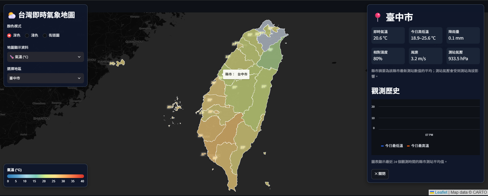

# ⛅ 台灣即時氣象地圖

[](https://twweatherapp.streamlit.app)

以 **Streamlit** + **Folium** 打造的全螢幕台灣即時氣象互動儀表板。  
即時觀測資料來自[中央氣象署（CWA）開放資料平台](https://opendata.cwa.gov.tw/)，經 Python 解析後存入 SQLite，並以互動式分級色彩地圖呈現。

---

## 🌐 線上展示

**👉 [https://twweatherapp.streamlit.app](https://twweatherapp.streamlit.app)**



---

## ✨ 功能特色

| 功能 | 說明 |
|---|---|
| 🗺️ **全螢幕分級色彩地圖** | 依氣溫、降雨量、濕度、風速或氣壓為台灣各縣市著色 |
| 📍 **縣市詳細資訊面板** | 點擊任意縣市，顯示即時數值與最近 24 筆觀測歷史圖表 |
| 🎨 **地圖底圖切換** | 深色 / 淺色 / 街道圖三種模式 |
| 📊 **五種氣象圖層** | 氣溫・降雨量・相對濕度・風速・測站氣壓 |
| 🔄 **自動更新** | 資料快取 5 分鐘；每次造訪皆重新查詢最新觀測 |

---

## 🗂️ 專案結構

```
new_cwa/
├── app.py                        # Streamlit 主程式（單頁應用）
├── src/
│   ├── __init__.py
│   ├── fetch_weather.py          # 從 CWA API 取得原始 JSON
│   ├── parse_weather.py          # 將 JSON 解析為 Pandas DataFrame
│   └── database.py               # SQLite 初始化、寫入與查詢
├── data/
│   ├── taiwan.geojson            # 縣市邊界多邊形資料
│   └── weather_raw.json          # 最新 API 原始回應（已加入 .gitignore）
├── .streamlit/
│   └── secrets.toml.example      # Streamlit Secrets 範本
├── requirements.txt
├── .env                          # 本機 API 金鑰（已加入 .gitignore）
└── .gitignore
```

---

## 🚀 本機安裝與執行

### 1. 複製專案並安裝套件

```bash
git clone https://github.com/jiwawa1006/new_cwa.git
cd new_cwa
python -m venv .venv

# Windows
.venv\Scripts\activate
# macOS / Linux
source .venv/bin/activate

pip install -r requirements.txt
```

### 2. 設定 API 金鑰

建立 `.env` 檔案（參考 `.streamlit/secrets.toml.example`）：

```env
CWA_API_KEY=CWA-XXXXXXXX-XXXX-XXXX-XXXX-XXXXXXXXXXXX
CWA_API=/api/v1/rest/datastore/O-A0001-001
MAP_API_KEY=          # 選填 – CARTO 地圖 API 金鑰
```

> 可至 [CWA 開放資料平台](https://opendata.cwa.gov.tw/) 免費申請 API 金鑰。

### 3. 初始化資料庫（首次執行）

```bash
python src/fetch_weather.py   # 下載 weather_raw.json
python src/database.py        # 建立 data.db 並匯入觀測資料
```

### 4. 啟動應用程式

```bash
streamlit run app.py
```

在瀏覽器開啟 **http://localhost:8501**。

---

## ☁️ 部署至 Streamlit Community Cloud

1. 將專案推送至 GitHub（`.env` 與 `data.db` 已被 `.gitignore` 排除）。
2. 前往 [share.streamlit.io](https://share.streamlit.io) → **New app** → 選擇此 repo 與 `app.py`。
3. 在 **App settings → Secrets** 貼上以下內容：

```toml
CWA_API_KEY = "CWA-XXXXXXXX-XXXX-XXXX-XXXX-XXXXXXXXXXXX"
CWA_API     = "/api/v1/rest/datastore/O-A0001-001"
MAP_API_KEY = ""   # 選填
```

4. 點擊部署。首次載入時，應用程式會自動從 CWA API 取得資料並初始化資料庫。

---

## 🛠️ 技術棧

- **Python 3.11+**
- [Streamlit](https://streamlit.io/) — 網頁框架
- [Folium](https://python-visualization.github.io/folium/) + [streamlit-folium](https://folium.streamlit.app/) — 互動式地圖
- [Pandas](https://pandas.pydata.org/) — 資料處理
- [SQLite](https://www.sqlite.org/) — 輕量級本地資料庫
- [CWA 開放資料 API](https://opendata.cwa.gov.tw/) — 即時氣象資料來源

---

## 📄 授權

MIT
