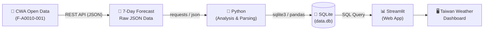

# 🌤️ HW10: Taiwan Weather Forecast
### From Meteorological Data to Interactive Weather Forecast Web App
**CWA API × JSON × Python × SQLite × Streamlit**

> *“Explore the weather through code, see Taiwan through data.”*  
> *“Connect with the real world through code, and let data tell the story of the weather!”*

---

## 📌 Project Overview

This project is a complete end-to-end data application pipeline. It ingests weekly weather forecast data from the Central Weather Administration (CWA) Open Data Platform, analyzes and parses the nested JSON structure with Python, stores structured data into a local SQLite database, and presents an interactive dashboard with trend charts, data tables, and an optional geospatial map using Streamlit.

### 🎯 Key Learning Objectives
- ✅ **Master Open Data API Integration**: Call REST APIs using HTTP requests and API key authentication.
- ✅ **Analyze JSON Data Structures**: Deconstruct complex nested trees and extract target data elements.
- ✅ **Build an SQLite Database**: Design relational table schemas, handle insertions, and perform SQL queries.
- ✅ **Develop Interactive Web Apps with Streamlit**: Build responsive web dashboards with user controls.
- ✅ **Enhance Data Processing & Visualization**: Integrate line charts, formatted tables, and interactive GIS maps.

---

## 🔄 System Architecture & Data Pipeline



---

## 📂 Recommended Project Structure

```text
.
├── fetch_weather.py      # [Step 1] Fetch raw JSON data from CWA API
├── parse_weather.py      # [Step 2] Parse JSON hierarchy and extract temperature records
├── database.py           # [Step 3] Create SQLite database & table, insert records
├── app.py                # [Step 4 & 5] Streamlit interactive Web App & map visualization
├── data.db               # SQLite database file
├── weather_data.csv      # (Optional) Intermediate CSV data
├── requirements.txt      # Project dependencies list
└── workflow.md           # Project workflow and documentation
```

---

## 🛠️ Step-by-Step Implementation Guide

### 1️⃣ Step 1: Fetch CWA API Data (20%)
* **Objective**: Use the CWA Open Data API to fetch 7-day weather forecasts for the 6 major regions of Taiwan (must be in JSON format).
* **Target Regions (6 Major Regions)**:
  - Northern Region (`北部地區`)
  - Central Region (`中部地區`)
  - Southern Region (`南部地區`)
  - Northeastern Region (`東北部地區`)
  - Eastern Region (`東部地區`)
  - Southeastern Region (`東南部地區`)
* **Key Tasks**:
  1. Make an HTTP GET request to CWA API with `requests` (Dataset ID: `F-A0010-001`).
  2. Inspect the returned JSON payload using `json.dumps`.
  3. Validate that data retrieval is successful.
* **Code Example**:
  ```python
  import requests
  import json

  url = "https://opendata.cwa.gov.tw/api/v1/rest/datastore/F-A0010-001"
  headers = {"Authorization": "YOUR_API_KEY"}  # Replace with your personal CWA API Key

  resp = requests.get(url, headers=headers, timeout=30)
  data = resp.json()
  print(json.dumps(data, indent=2, ensure_ascii=False))
  ```

---

### 2️⃣ Step 2: Parse JSON & Extract Temperature Data (20%)
* **Objective**: Parse the nested JSON structure, locate and extract daily minimum (`MinT`) and maximum (`MaxT`) temperatures.
  > *Note: Regions in the CWA data structure are typically represented by `location`.*
* **JSON Structure Breakdown**:
  ```text
  JSON
  └── records
      └── locations
          └── location[] (Region / Location)
              └── weatherElement[] (Weather Elements)
                  └── time[] (Forecast Time Window)
                      ├── elementName: MinT (Minimum Temperature)
                      └── elementName: MaxT (Maximum Temperature)
  ```
* **Extraction Result Example**:
  | regionName | dataDate | minT | maxT |
  | :--- | :---: | :---: | :---: |
  | 北部地區 | 2026-04-14 | 18 | 26 |
  | 中部地區 | 2026-04-14 | 20 | 30 |
  | 南部地區 | 2026-04-14 | 22 | 31 |

---

### 3️⃣ Step 3: Store into SQLite Database (20%)
* **Objective**: Save the cleaned temperature data into a local SQLite database (`data.db`).
* **Database Schema Design**:
  ```sql
  CREATE TABLE IF NOT EXISTS TemperatureForecasts (
      id INTEGER PRIMARY KEY AUTOINCREMENT,
      regionName TEXT,
      dataDate TEXT,
      minT REAL,
      maxT REAL
  );
  ```
* **Verification Queries**:
  ```sql
  -- 1. List all distinct region names
  SELECT DISTINCT regionName FROM TemperatureForecasts;

  -- 2. Query forecast data for Central Region
  SELECT * FROM TemperatureForecasts WHERE regionName = '中部地區';
  ```

---

### 4️⃣ Step 4: Streamlit Weather Forecast Web App (40%)
* **Objective**: Build an interactive web dashboard that queries SQLite and displays temperature trends and data tables.
* **Functional Requirements**:
  1. **Region Selector**: Dropdown menu allowing users to select any of the 6 regions.
  2. **SQL Query**: Retrieve data from `data.db` directly using SQL queries in the Streamlit app.
  3. **Temperature Line Chart**: Interactive chart illustrating MaxT and MinT trends over a 7-day period.
  4. **Weekly Data Table**: Clean table showing date, MinT, and MaxT.
* **Code Skeleton**:
  ```python
  import streamlit as st
  import sqlite3
  import pandas as pd

  conn = sqlite3.connect("data.db")
  # Execute SQL query based on selected region
  # Render line charts and dataframe table
  ```

---

### 5️⃣ Step 5: Advanced: Taiwan Map Visualization (Optional / Bonus)
* **Objective**: Create an interactive map of Taiwan showing each region's daily average temperature (recommended: `folium` + `streamlit-folium`).
* **Temperature Color Scale**:
  - 🔵 `< 20°C` (Blue)
  - 🟢 `20 - 25°C` (Green)
  - 🟡 `25 - 30°C` (Yellow)
  - 🔴 `> 30°C` (Red)
* **Interactive Popup**: Display Region Name, Date, MinT, MaxT, and Average Temperature when clicked.

---

## 💯 Grading Rubric

| Major Category | Detailed Evaluation Criteria | Weight |
| :--- | :--- | :---: |
| **1. Fetch CWA API Data** | Data Retrieval (10%), JSON Inspection (5%), Code Quality (5%) | **20%** |
| **2. Parse JSON Data** | Accurate Extraction (10%), Data Verification (5%), Code Quality (5%) | **20%** |
| **3. SQLite Storage** | Data Insertion (10%), Query Verification (5%), Code Quality (5%) | **20%** |
| **4. Streamlit Web App** | Dropdown Selector (10%), Line Chart & Table (15%), SQLite Query (10%), Code Quality (5%) | **40%** |
| **5. Advanced Map Visualization** | Interactive Map, Color Grading, Popup Info | **Bonus** |

---

## ⚡ Quick Start Guide

### 1. Set Up Virtual Environment (Recommended)
```bash
python -m venv venv

# Windows (PowerShell / CMD)
venv\Scripts\activate

# macOS / Linux
source venv/bin/activate
```

### 2. Install Required Dependencies
Create a `requirements.txt` file and install:
```bash
pip install -r requirements.txt
```
> **Required Packages**:
> - `requests`
> - `pandas`
> - `streamlit`
> - `folium` (optional for Step 5)
> - `streamlit-folium` (optional for Step 5)

### 3. Run Data Pipeline (Run Once to Populate Database)
```bash
python fetch_weather.py
python parse_weather.py
python database.py
```

### 4. Launch the Streamlit Web Application
```bash
streamlit run app.py
```

---

## ⚠️ Important Guidelines & Notices

1. **API Key Security**: You must register and use **your own personal CWA API Key**. Never hard-code or commit your API Key publicly to GitHub (use `.env` or environment variables).
2. **Architecture Separation**: The Streamlit Web App **must query data directly from SQLite (`data.db`)**, not by making API requests during page renders.
3. **Data Completeness**: Ensure all 6 regions are successfully parsed and stored, covering a full 7-day forecast.
4. **Implementation Strategy**: Complete and verify steps 1 through 4 first before proceeding to the optional Step 5 map visualization.
