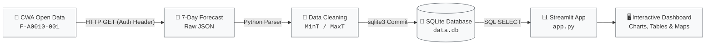

<div align="center">

# 🌤️ HW10: Taiwan Weather Forecast Web App
### End-to-End Implementation Workflow & Evaluation Guide
**CWA API × JSON × Python × SQLite × Streamlit**

[](https://www.python.org/)
[](https://www.sqlite.org/)
[](https://streamlit.io/)
[](https://python-visualization.github.io/folium/)
[](#-grading-rubric)

<br/>

> 🎯 *“Explore the weather through code, see Taiwan through data.”*  
> 💡 *“Connect with the real world through code, and let data tell the story of the weather!”*

---

</div>

## 📌 Executive Summary

This workflow document details the complete end-to-end implementation requirements for **HW10: Taiwan Weather Forecast**.  
The pipeline ingests weekly forecast data from the **Central Weather Administration (CWA)** Open Data platform, performs JSON structure extraction, maintains relational persistence in **SQLite**, and presents an interactive user dashboard using **Streamlit** (with optional **Folium** geospatial mapping).

### 🎯 Key Competencies
* [x] **Open Data API Mastery**: Handle RESTful API requests with authentication tokens.
* [x] **JSON Architecture Parsing**: Navigate deep nested payloads and extract specific keys.
* [x] **Relational Schema & SQL**: Model clean tabular schemas, insert batch records, and execute analytical queries.
* [x] **Interactive Dashboarding**: Build user-driven web interfaces with dynamic filtering, line charts, and tables.
* [x] **Data Storytelling**: Translate raw meteorological metrics into intuitive visual experiences.

---

## 🔄 End-to-End Architecture



---

## 📂 Standard Project Structure

```text
d:/File/
├── fetch_weather.py      # [Step 1] Ingest raw JSON forecast from CWA API
├── parse_weather.py      # [Step 2] Traverse JSON tree and extract temperature metrics
├── database.py           # [Step 3] Initialize SQLite schema and persist records
├── app.py                # [Step 4 & 5] Streamlit application (Dashboard & Map)
├── data.db               # [Step 3] SQLite persistent database file
├── requirements.txt      # Python dependencies list
├── workflow.md           # Implementation & grading specifications (This file)
└── README.md             # Project homepage & 24-lesson learning roadmap
```

---

## 🛠️ Step-by-Step Implementation Guide

---

### 1️⃣ Step 1: Fetch CWA API Data
> **Weight**: `20%` ｜ **Primary Script**: `fetch_weather.py`

#### Objective
Query the Central Weather Administration (CWA) Open Data API to fetch 7-day weather forecast records for the **6 major regions** of Taiwan in JSON format.

#### Target Regions (All 6 Required)
* Northern Region (`北部地區`)
* Central Region (`中部地區`)
* Southern Region (`南部地區`)
* Northeastern Region (`東北部地區`)
* Eastern Region (`東部地區`)
* Southeastern Region (`東南部地區`)

#### Implementation Checklist
1. Register on CWA Open Data and generate your personal API authorization key.
2. Send an HTTP GET request to dataset `F-A0010-001` using `requests`.
3. Verify successful HTTP response status (`200 OK`) and inspect returned payload using `json.dumps(..., indent=2)`.

```python
import requests
import json

url = "https://opendata.cwa.gov.tw/api/v1/rest/datastore/F-A0010-001"
headers = {"Authorization": "YOUR_PERSONAL_API_KEY"}

response = requests.get(url, headers=headers, timeout=30)
response.raise_for_status()

data = response.json()
print(json.dumps(data, indent=2, ensure_ascii=False))
```

> **Grading Criteria**: Data Ingestion (`10%`) ｜ JSON Inspection (`5%`) ｜ Code Quality (`5%`)

---

### 2️⃣ Step 2: Parse JSON & Extract Temperature Data
> **Weight**: `20%` ｜ **Primary Script**: `parse_weather.py`

#### Objective
Traverse the hierarchical JSON tree, locate temperature elements, and extract the daily minimum (`MinT`) and maximum (`MaxT`) values for each region.

#### Hierarchy Traversal Map
```text
JSON Root
└── records
    └── locations
        └── location[]                  --> 6 Regional Entities
            └── weatherElement[]        --> Weather parameters
                └── time[]              --> Forecast intervals
                    ├── elementName: MinT (Daily Minimum Temp)
                    └── elementName: MaxT (Daily Maximum Temp)
```

#### Target Output Schema
| `regionName` | `dataDate` | `minT` | `maxT` |
| :--- | :---: | :---: | :---: |
| 北部地區 | 2026-04-14 | 18.0 | 26.0 |
| 中部地區 | 2026-04-14 | 20.0 | 30.0 |
| 南部地區 | 2026-04-14 | 22.0 | 31.0 |

> **Grading Criteria**: Extraction Accuracy (`10%`) ｜ Data Validation (`5%`) ｜ Code Quality (`5%`)

---

### 3️⃣ Step 3: Store into SQLite Database
> **Weight**: `20%` ｜ **Primary Script**: `database.py`

#### Objective
Initialize a local SQLite relational database (`data.db`) and insert the structured regional forecast records.

#### DDL Schema Definition
```sql
CREATE TABLE IF NOT EXISTS TemperatureForecasts (
    id         INTEGER PRIMARY KEY AUTOINCREMENT,
    regionName TEXT NOT NULL,
    dataDate   TEXT NOT NULL,
    minT       REAL NOT NULL,
    maxT       REAL NOT NULL
);
```

#### SQL Verification Queries
```sql
-- 1. Confirm all 6 regions are persisted
SELECT DISTINCT regionName FROM TemperatureForecasts;

-- 2. Validate forecast sequence for a selected region
SELECT dataDate, minT, maxT 
FROM TemperatureForecasts 
WHERE regionName = '中部地區' 
ORDER BY dataDate ASC;
```

> **Grading Criteria**: Database Insertion (`10%`) ｜ Query Verification (`5%`) ｜ Code Quality (`5%`)

---

### 4️⃣ Step 4: Streamlit Weather Forecast Web App
> **Weight**: `40%` ｜ **Primary Script**: `app.py`

#### Objective
Build a responsive web application that queries SQLite on demand and renders user controls, dynamic trend charts, and formatted tables.

#### Feature Requirements
* **Region Dropdown**: `st.selectbox` containing all 6 regions.
* **SQL Query Execution**: Fetch records from `data.db` directly using SQL parameters.
* **Temperature Line Chart**: Interactive multi-line chart showcasing `MaxT` (Red) vs. `MinT` (Blue) over a 7-day span.
* **Weekly Data Table**: Clean, legible data frame displaying the 7-day forecast figures.

```python
import streamlit as st
import sqlite3
import pandas as pd

st.title("Taiwan Weather Forecast")

# Dropdown selection
region = st.selectbox("Select Region", ["北部地區", "中部地區", "南部地區", "東北部地區", "東部地區", "東南部地區"])

# Query SQLite
conn = sqlite3.connect("data.db")
query = "SELECT dataDate, minT, maxT FROM TemperatureForecasts WHERE regionName = ?"
df = pd.read_sql_query(query, conn, params=(region,))
conn.close()

# Visualizations
st.subheader(f"Temperature Forecast - {region}")
st.line_chart(df.set_index("dataDate")[["maxT", "minT"]])
st.dataframe(df)
```

> **Grading Criteria**: Dropdown Selector (`10%`) ｜ Charts & Tables (`15%`) ｜ SQLite Integration (`10%`) ｜ Code Quality (`5%`)

---

### 5️⃣ Step 5: Advanced Taiwan Map Visualization
> **Weight**: `Optional Bonus` ｜ **Integration**: `folium` + `streamlit-folium`

#### Objective
Render an interactive map of Taiwan with regional pinpoints color-coded according to the daily average temperature (`(minT + maxT) / 2`).

#### Temperature Color Index
| Temperature Range | Color Code | Visual Meaning |
| :---: | :---: | :--- |
| **< 20°C** | 🔵 `Blue` | Cool / Cold |
| **20°C ~ 25°C** | 🟢 `Green` | Mild / Comfortable |
| **25°C ~ 30°C** | 🟡 `Yellow` | Warm |
| **> 30°C** | 🔴 `Red` | Hot |

* **Interactive Popups**: Clicking a marker reveals the region name, selected date, minimum temperature, maximum temperature, and average temperature.

---

## 💯 Grading Rubric

| Major Milestone | Evaluation Criteria | Allocation |
| :--- | :--- | :---: |
| **1. CWA API Ingestion** | Successful API query (10%), JSON verification (5%), Code structure (5%) | **20%** |
| **2. JSON Parsing** | Accurate MinT/MaxT extraction (10%), Data validity (5%), Clean code (5%) | **20%** |
| **3. SQLite Storage** | Schema creation & data insertion (10%), Verification SQL (5%), Quality (5%) | **20%** |
| **4. Streamlit Dashboard** | Region dropdown (10%), Charts & tables (15%), SQLite query (10%), Quality (5%) | **40%** |
| **5. Map Visualization** | Folium map integration, dynamic color coding, date picker & popups | **Bonus** |

---

## ⚡ Quick Start Execution Sequence

```bash
# 1. Initialize virtual environment
python -m venv venv
source venv/bin/activate  # Windows: venv\Scripts\activate

# 2. Install requirements
pip install -r requirements.txt

# 3. Execute ETL pipeline (Run once to create data.db)
python fetch_weather.py
python parse_weather.py
python database.py

# 4. Launch web application
streamlit run app.py
```

---

## ⚠️ Important Guidelines

> [!IMPORTANT]
> * **API Key Security**: Always use your personal CWA API key. Store keys in environment variables or `.env` files. **Do NOT commit API keys to public repositories.**
> * **Architectural Decoupling**: Streamlit **must query data from SQLite**, never directly from the CWA API on each page load.
> * **Data Integrity**: Confirm that all **6 regions** contain complete, non-null data for the entire **7-day forecast period**.
